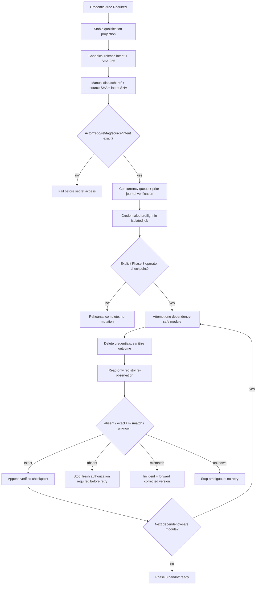

# Phase 7: Release Safety, Intent, and Recovery Automation - Research

**Researched:** 2026-07-18
**Domain:** Deterministic release intent, GitHub Actions authorization, isolated Mooncakes publication, resumable forward-only recovery
**Confidence:** HIGH for repository architecture and pinned CLI behavior; MEDIUM for current GitHub-hosted controls; LOW nowhere

<user_constraints>
## User Constraints (from CONTEXT.md)

### Locked Decisions

### Immutable Release Intent

- **D-01:** Required produces a closed-schema canonical JSON intent plus SHA-256 digest. The digest is the authorization identity; mutable filenames, prose, workflow inputs, or branch names are not authorization authority.
- **D-02:** The intent binds the trusted Git ref, exact source commit, pinned toolchain, ordered `tchivs/*` module identities and `0.1.0` versions, exact dependency graph, public package inventories, archive digests, interface-baseline digests, and qualification report/evidence digests.
- **D-03:** Use a dedicated immutable module-release tag/ref distinct from the existing `v0.1` milestone tag. Planning may select the exact conventional spelling, but the publisher must reject a movable branch, mismatched tag target, or intent generated from a dirty/untrusted source.
- **D-04:** Intent generation remains credential-free, deterministic, reproducible on a clean checkout, and part of Required. Rebuilding the same source and inputs must reproduce the same canonical digest.

### Sole-Maintainer Authorization and Secret Isolation

- **D-05:** Authorization is an explicit manual GitHub Actions dispatch by the sole maintainer `tchivs`, naming the exact release ref, source SHA, and intent SHA-256. No second approver, quorum, or organization-only ceremony is introduced.
- **D-06:** The publisher validates the dispatch actor, repository, default/protected trusted ref, immutable tag target, source SHA, and intent digest before requesting or exposing any Mooncakes credential. A mismatch fails before mutation.
- **D-07:** GitHub workflow permissions are read-only by default. Every third-party action is pinned to a full commit SHA. The Mooncakes secret is referenced only by the isolated mutation step in a dedicated publisher job/environment; preparation, Required, pull requests, and consumer verification never receive it.
- **D-08:** A current `moon whoami` match, read-only module/version observation, package/archive verification, and `moon publish --dry-run` are mandatory preflight evidence. They prove local identity and command readiness, not remote publish authority. Definitive remote authority is established only by the first real successful publication response and subsequent read-only registry observation.
- **D-09:** Phase 7 builds and rehearses the publisher without silently consuming a production version. The first irreversible Mooncakes mutation is an explicit operator checkpoint and belongs to the authorized live release transition feeding Phase 8, not an incidental test.

### Serialization and Monotonic Journal

- **D-10:** Use one release-wide GitHub Actions concurrency group derived from repository plus `root_intent_sha256`, where the root is literally the canonical initial intent digest, with `cancel-in-progress: false`. Initial dispatch requires `root_intent_sha256 == intent_sha256`; every correction retains that root while binding its own current digest, exact predecessor, and monotonic successor sequence. A newer dispatch cannot cancel or supersede an in-progress publication.
- **D-11:** The publisher state machine is strictly monotonic: intent authorized → preflight passed → core mutation attempted → core registry state observed → core checkpoint verified → color attempted/observed/verified → image attempted/observed/verified → handoff ready. No transition may skip dependency order or move backward.
- **D-12:** Every transition appends a closed-schema, content-addressed journal record containing sequence number, prior-record digest, intent digest, sanitized observation, outcome, and timestamp. Raw credentials, headers, cookies, local credential paths, and unredacted CLI output are prohibited.
- **D-13:** Preserve completed checkpoints as GitHub workflow artifacts named by intent digest and sequence. Resume requires the exact prior run/artifact identity and verifies the full digest chain; registry re-observation remains authoritative when artifact state and external state disagree or an artifact expires.
- **D-14:** A duplicate or replayed dispatch with the same intent never republishes a verified module. It re-observes registry state, validates identity, records an idempotent checkpoint, and continues only to the next unpublished dependency-safe module.

### Failure and Forward-Only Recovery

- **D-15:** Credential-free rehearsals cover timeout/unknown outcome, partial success, existing matching version, existing mismatched version, invalid credential, evidence failure, replay, concurrent dispatch, cancellation, and dependency-order violation.
- **D-16:** Any ambiguous publish result stops mutation and performs read-only re-observation. Retry is permitted only when the exact version is still absent and a fresh authorization/preflight remains valid; an observed exact match is checkpointed without republishing.
- **D-17:** Published content that does not match the authorized archive/metadata intent is an incident. Automation stops, preserves evidence, and requires a newly generated and newly authorized forward-corrected unpublished version plus advisory. It never assumes overwrite, delete, unpublish, yank, transfer, or rename support.
- **D-18:** Invalid credentials and stale/mismatched evidence must fail before publication where observable. Authentication failure never weakens the intent or falls back to a different account, namespace, module identity, credential source, or untrusted ref.

### the agent's Discretion

- Exact schema filenames, PowerShell helper boundaries, journal artifact retention, and diagnostic codes, provided the contracts above remain deterministic, closed, content-addressed, and secret-free.
- Exact dedicated release tag spelling and GitHub environment name, provided they are stable, repository-scoped, distinct from the existing `v0.1` tag, and machine-validated.
- Whether the local state-machine engine is one script or narrowly separated generation, validation, and execution scripts, provided only the final isolated mutation step can read the credential.

### Deferred Ideas (OUT OF SCOPE)

- Actual registry-only consumer proofs and the three-module live publication sequence — Phase 8 after the Phase 7 publisher and authorization gate are verified.
- Immutable public ledger, artifact provenance, GitHub release closure, and final milestone audit — Phase 9.
- Mooncakes OIDC/federated publishing — future requirement only after official registry support is documented.
- Organization namespace migration, destructive recovery, multi-maintainer approvals, and new module families — outside v0.2.
</user_constraints>

<phase_requirements>
## Phase Requirements

| ID | Description | Research Support |
|----|-------------|------------------|
| REL-01 | Required produces an immutable release intent binding the exact release ref, source, modules, dependencies, inventory, archives, interfaces, and qualification evidence. | Use an acyclic stable-evidence projection, a closed MNF canonical-JSON profile, and SHA-256 from the existing qualification helper seam. [VERIFIED: repository inspection] |
| REL-02 | Only the sole maintainer may authorize the exact intent from a protected ref, with SHA-pinned actions, read-only permissions, and isolated credential access. | Use `workflow_dispatch`, exact context/input validation, a protected tag, `permissions: {}`/`contents: read`, and a `mooncakes-production` environment whose secret is mapped only into one mutation step. [CITED: https://docs.github.com/en/actions/reference/workflows-and-actions/workflow-syntax] |
| REL-03 | A global lock and monotonic journal prevent concurrency, replay, duplication, cancellation, and dependency-order violations. | Use repository-plus-`root_intent_sha256` concurrency with `cancel-in-progress: false` and `queue: max`; require initial root/current equality and correction root/predecessor/sequence binding, then enforce replay/order in a pure state reducer and hash-chained records. GitHub concurrency alone is insufficient. [CITED: https://docs.github.com/en/actions/reference/workflows-and-actions/workflow-syntax] |
| REL-04 | Credential-free negative rehearsals cover ambiguous and failed outcomes and require registry re-observation before retry. | Separate the deterministic state engine from live command adapters; fixtures inject sanitized observer/mutator results without network or credentials. [VERIFIED: repository negative-test pattern] |
| REL-05 | Recovery preserves correct checkpoints, re-observes ambiguity, re-authorizes corrections, and never assumes destructive recovery. | Make registry observation authoritative, require exact archive/metadata comparison, and terminate mismatches with incident evidence plus a new unpublished version path. [VERIFIED: Phase 6 forward-only policy] |
</phase_requirements>

## Summary

Phase 7 should be planned as a control-plane phase, not as the live three-module publication itself. The existing repository already supplies deterministic clean-clone archives, exact module order, package inventories, interface-baseline manifests, stable hashing helpers, fail-closed registry observations, and a credential-free Required wrapper. The new work is to close these upstream facts into one acyclic intent, authorize its digest, and drive a pure monotonic state machine whose only side-effect seam is one module mutation followed immediately by read-only observation. [VERIFIED: `policy/release-qualification.json`, `Invoke-ReleaseQualification.ps1`, `ReleaseQualification.Common.ps1`]

The successful local login is real but deliberately narrow evidence. In pinned Moon source, `moon whoami` opens `$MOON_HOME/credentials.json` and reports the stored token/username state; it performs no remote authority query. The pinned CLI exposes `moon publish --dry-run`, while official command documentation describes publish as operating on the current module. Therefore `whoami` and dry-run belong in credentialed preflight but cannot advance `authenticated_publish_seam` or `namespace_authority` to proven before the first successful real response and registry re-observation. [VERIFIED: https://github.com/moonbitlang/moon/blob/75c7e1f/crates/moon/src/cli/whoami.rs] [CITED: https://docs.moonbitlang.com/en/latest/toolchain/moon/commands.html]

GitHub Actions provides the necessary hosted controls, but no single control provides the whole safety contract. Environment secrets are job-scoped and withheld until environment rules pass, workflow permissions can be reduced to none/read, full-SHA action enforcement exists, protected tag rulesets can restrict tag changes, and workflow concurrency can preserve an in-progress run. Queueing, intent validation, journal replay detection, and registry re-observation still need explicit implementation. [CITED: https://docs.github.com/en/actions/reference/workflows-and-actions/deployments-and-environments] [CITED: https://docs.github.com/en/repositories/managing-your-repositorys-settings-and-features/enabling-features-for-your-repository/managing-github-actions-settings-for-a-repository]

**Primary recommendation:** implement five horizontal layers in order—closed schemas/canonicalization, credential-free intent integration, pure publisher reducer and journal, adversarial rehearsals, then a manually dispatched isolated workflow—while leaving the first actual `moon publish` behind the Phase 8 operator checkpoint.

## Architectural Responsibility Map

| Capability | Primary Tier | Secondary Tier | Rationale |
|------------|-------------|----------------|-----------|
| Stable evidence and release-intent generation | Qualification/build tier | Git source | Existing Required owns archive and evidence production; the intent must remain credential-free. [VERIFIED: repository inspection] |
| Sole-maintainer authorization | GitHub Actions control plane | Protected Git ref | GitHub supplies actor, repository, ref, SHA, inputs, environments, and repository rules. [CITED: https://docs.github.com/en/actions/reference/workflows-and-actions/workflow-syntax] |
| Transition legality and replay prevention | Local publisher engine | GitHub concurrency | A deterministic reducer owns allowed transitions; hosted concurrency only serializes runs. [VERIFIED: locked D-10 through D-14] |
| Credential materialization and `moon publish` | Isolated publisher step | Ephemeral `$MOON_HOME` | Pinned Moon reads credentials from `$MOON_HOME/credentials.json`; the file can be created and removed inside one step. [VERIFIED: pinned Moon source] |
| External truth after an attempt | Mooncakes registry | Sanitized journal | Registry re-observation decides absent/matching/mismatched/unknown; CLI exit text alone is not authoritative. [VERIFIED: locked D-13, D-16, D-17] |
| Resume checkpoints | GitHub artifact store | Registry observation | Artifacts preserve the digest chain, while registry truth wins after expiration or disagreement. [CITED: https://docs.github.com/en/actions/tutorials/store-and-share-data] |

## Project Constraints (from AGENTS.md)

- Keep core algorithms and shared models in MoonBit; Phase 7 automation may remain PowerShell because it is release control rather than a public runtime library. [VERIFIED: AGENTS.md]
- Preserve Native as the primary performance/system target and all four portable qualification targets. [VERIFIED: AGENTS.md]
- Do not broaden FFI, module families, or public dependency boundaries. [VERIFIED: AGENTS.md]
- Keep public package dependencies acyclic and explicitly documented. [VERIFIED: AGENTS.md]
- Preserve Semantic Versioning policy and visibly experimental status. [VERIFIED: AGENTS.md]
- Keep operations deterministic and GUI-independent for CLI/agent use. [VERIFIED: AGENTS.md]
- Do not claim performance without reproducible workloads. [VERIFIED: AGENTS.md]
- Do not silently redefine architecture/governance; boundary changes require RFCs. [VERIFIED: AGENTS.md]
- Start edits through GSD execution; planning research does not authorize implementation edits. [VERIFIED: AGENTS.md]
- Prefer the project knowledge graph for code discovery when available; `.planning/graphs/graph.json` is absent in this checkout, so targeted file reads were used. [VERIFIED: local probe]

## Standard Stack

### Core

| Component | Verified version/pin | Purpose | Why Standard |
|-----------|----------------------|---------|--------------|
| PowerShell | 7+; local `7.6.3` | Closed-schema validation, deterministic evidence, reducer, fixtures | Already owns every release/quality seam and runs cross-platform in GitHub-hosted jobs. [VERIFIED: local probe and repository inspection] |
| `moon` | `0.1.20260713` (`75c7e1f`) | package, dry-run, and isolated publish command | Exact project pin; its source confirms selected-member publish and local credential lookup. [VERIFIED: local probe and pinned source] |
| `moonc` / `moonrun` | `v0.10.4+2cc641edf` / `0.1.20260713` | intent-bound toolchain identity and Required evidence | Already enforced by the Phase 6 authority and qualification policies. [VERIFIED: repository inspection] |
| Git | local `2.54.0.windows.1` | clean-source proof, full-SHA/ref/tag target validation | Git is authoritative for object/ref resolution; use `rev-parse`, not string inference. [VERIFIED: local probe] |
| GitHub Actions | hosted workflow | manual authorization, environment gate, concurrency, artifact checkpoints | Official controls match the locked sole-maintainer design. [CITED: https://docs.github.com/en/actions/reference/workflows-and-actions/workflow-syntax] |
| .NET SHA-256 | `System.Security.Cryptography.SHA256` | intent and journal content addressing | Existing helper already uses the platform primitive; no custom cryptography is needed. [VERIFIED: `ReleaseQualification.Common.ps1`] |

### Workflow Actions

| Action | Verified release/pin | Purpose | Policy |
|--------|----------------------|---------|--------|
| `actions/checkout` | existing repository pin `11bd71901bbe5b1630ceea73d27597364c9af683` | credential-free checkout | Reuse the already-qualified full SHA unless a separately tested upgrade is required. [VERIFIED: `.github/workflows/quality.yml`] |
| `hustcer/setup-moonbit` | existing pin `bdc8c076af1f4c5012a6ac3451a2009ec75bf921` | exact MoonBit toolchain | Reuse the current full SHA and exact version input. [VERIFIED: `.github/workflows/quality.yml`] |
| `actions/upload-artifact` | `v7.0.1` → `043fb46d1a93c77aae656e7c1c64a875d1fc6a0a` | immutable checkpoint upload | Pin the resolved full SHA; use intent/sequence artifact names and 90-day retention. [VERIFIED: GitHub API, official repository, 2026-07-18] |
| `actions/download-artifact` | `v8.0.1` → `3e5f45b2cfb9172054b4087a40e8e0b5a5461e7c` | exact prior checkpoint retrieval | Pin the resolved full SHA and require explicit prior run/artifact identity. [VERIFIED: GitHub API, official repository, 2026-07-18] |

No new npm, PyPI, crates.io, or Mooncakes dependency is required. Package-legitimacy auditing is therefore not applicable; workflow actions are official/repository-existing and are controlled by full commit SHAs. [VERIFIED: research scope]

## Architecture Patterns

### System Architecture Diagram



### Recommended Project Structure

```text
policy/
└── release-control.json                         # tag, environment, actor, repository, order, rules
release/
├── intent/
│   ├── schema.json                              # closed release-intent schema
│   └── README.md                                # explanatory, never authoritative
├── journal/
│   ├── record-schema.json                       # closed hash-chain record
│   └── state-schema.json                        # allowed monotonic states/outcomes
├── prepared/
│   └── schema.json                              # closed content-addressed cross-job manifest
└── qualification/
    └── phase-07-requirements.json               # reciprocal REL-01..05 coverage
scripts/quality/
├── New-ReleaseIntent.ps1                        # credential-free stable projection + intent
├── Test-ReleaseIntent.ps1                       # schema/ref/source/digest checks
├── ReleasePublisher.Common.ps1                  # pure reducer, journal, sanitization
├── Invoke-ReleasePublisher.ps1                  # adapter-driven orchestration
├── Test-ReleasePublisherNegative.ps1            # credential-free scenario matrix
└── Test-Phase07Qualification.ps1                 # reciprocal ledger + Required boundary
.github/workflows/
└── publish-modules.yml                          # manual, read-only, queued, environment-isolated
```

### Pattern 1: Acyclic Evidence Binding

Generate and hash evidence in this order: deterministic archive/interface/qualification projection → intent → final Required wrapper that records the intent digest. Never make the intent hash the final wrapper that itself embeds the intent hash. The existing raw Required report contains run-local timestamps/path/OS fields, so the intent must bind its stable projection/deterministic digest and named evidence digests rather than raw report bytes. [VERIFIED: `Write-RequiredQualificationReport` and D-02]

Recommended canonical profile: closed schema; ASCII field names and controlled ASCII values; objects emitted in schema order; arrays preserve policy order; only strings, booleans, null, and bounded integers; floats forbidden; UTF-8 without BOM; compact JSON; no trailing whitespace. This is narrower and easier to verify than implementing a general canonical-JSON standard. [VERIFIED: existing controlled release data types]

### Pattern 2: Pure Reducer Plus Side-Effect Adapters

The engine accepts `(intent, verified journal, sanitized observation, requested operation)` and returns either one legal next command/record or an exact diagnostic. The engine must not read credentials or call Mooncakes. A live adapter performs exactly one authorized command; fixture adapters produce timeout, invalid-auth, matching-version, mismatch, replay, cancellation, and dependency-order outcomes without network access. [VERIFIED: repository negative-fixture conventions and D-15]

### Pattern 3: Observe-Decide-Mutate-Observe

Before every module attempt, verify all upstream checkpoints and re-observe the exact target version. After any attempted mutation—success, timeout, nonzero exit, or lost output—delete credential material and re-observe before deciding. Only an exact observed match becomes a verified checkpoint; absence requires fresh authorization before retry; mismatch/unknown stops. [VERIFIED: D-14 through D-18]

### Pattern 4: Bootstrap Authority Split

Keep two truthful gates. `preflight_passed` means actor/ref/source/intent, local account, command shape, dry-run, archives, and version absence are current; it does not set general publication readiness true. The one-time Phase 8 bootstrap transition may attempt only `tchivs/mb-core@0.1.0` after explicit authorization while remote authority remains bootstrap-unknown. Only a successful response plus read-only registry observation can record the authenticated seam and verified core checkpoint. [VERIFIED: D-08, D-09, Phase 6 handoff]

### Pattern 5: Hosted Serialization Backed by Journal Semantics

Use the locked group identity and enable the official queue mode:

```yaml
# Source: GitHub workflow syntax documentation
concurrency:
  group: mnf-release-${{ github.repository }}-${{ inputs.root_intent_sha256 }}
  cancel-in-progress: false
  queue: max
```

`root_intent_sha256` is not a separate lineage projection: it is the canonical initial `intent_sha256`. Initial dispatch must prove equality; a correction must carry the same immutable root while its current canonical intent binds the exact predecessor and previous sequence+1. This keeps every correction in one repository-wide release family lock while preserving a distinct current authorization identity. GitHub documents that the default permits only one pending run and may replace an older pending run; `queue: max` retains a queue, while the reducer still rejects replay/duplicates and assumes no execution ordering from dispatch time alone. [CITED: https://docs.github.com/en/actions/reference/workflows-and-actions/workflow-syntax]

### Pattern 6: Content-Addressed Prepared-Bundle Trust Boundary

Treat the prepare/publisher job edge as an untrusted file-transfer boundary. The secret-free prepare job checks out the exact source SHA, validates root/current intent and journal bindings, and emits one closed `release/prepared/schema.json` manifest plus an exact payload inventory. The schema follows the repository's closed package and authority-observation contracts: `additionalProperties: false`, stable ordered roles, path/size/SHA-256 for every payload, sanitized observation fields only, and no raw output or credential material. The manifest binds repository, actor, run/attempt, ref, source SHA, `root_intent_sha256`, current `intent_sha256`, mode, prior-chain/genesis identity, toolchain, qualification artifacts, and the exact source/scripts/policy/schema payload. After canonical writing, prepare hashes the manifest and uploads `mnf-prepared-<root-intent>-<current-intent>-<manifest-sha256>`; the manifest never hashes itself.

The publisher has `actions: read` only, performs no checkout, and downloads only that exact job-output artifact from the current `github.run_id`. A trusted inline verifier must compare the downloaded manifest bytes with the prepare-job digest, reject missing/extra/duplicate/path-escaping files, recompute every payload digest, and revalidate actor/ref/source/root/current/mode/journal bindings before the workflow may reference the Mooncakes secret. The GitHub token is confined to pinned official exact-run download actions; no `uses:` action receives the Mooncakes credential. This makes the content-addressed bundle—not ambient workspace state—the sole cross-job qualification input. [VERIFIED: closed package/authority-observation schemas and D-02, D-07, D-10 through D-13]

### Pattern 7: Step-Scoped Credential Hydration

Use environment `mooncakes-production`. Preparation jobs have no environment and no secret. The publisher job validates all non-secret facts first; only one PowerShell mutation step maps `secrets.MOONCAKES_TOKEN`, creates an ephemeral `$MOON_HOME/credentials.json` with username `tchivs`, runs credentialed preflight/one authorized mutation, sanitizes the result, and removes the entire ephemeral home in `finally`. No action or later step receives the secret environment variable. [VERIFIED: pinned Moon credentials source and D-06 through D-08]

### Anti-Patterns to Avoid

- **Hash cycle:** intent ↔ final Required report references make reproducible identity impossible; bind a stable upstream projection. [VERIFIED: repository report structure]
- **Treating `whoami` as remote authorization:** it reads local credential state only. [VERIFIED: pinned Moon source]
- **Trusting workflow input as authority:** resolve the input ref locally/remotely and compare the protected tag target, `github.sha`, source SHA, and intent SHA. [CITED: https://docs.github.com/en/actions/reference/workflows-and-actions/workflow-syntax]
- **Using concurrency as replay protection:** concurrency controls scheduling, not registry/idempotency truth. [CITED: GitHub concurrency documentation]
- **Passing secrets at job/workflow scope:** map the secret only in the mutation step and remove its filesystem projection before producing journal evidence. [CITED: GitHub environment-secret documentation]
- **Retrying on CLI failure alone:** timeout or nonzero exit is ambiguous until registry re-observation. [VERIFIED: D-16]
- **Overwriting a mismatch:** stop and move forward with a newly authorized unpublished version/advisory. [VERIFIED: D-17]
- **Recording raw command output:** only closed sanitized enums/codes may enter the journal. [VERIFIED: D-12]

## Don't Hand-Roll

| Problem | Don't Build | Use Instead | Why |
|---------|-------------|-------------|-----|
| SHA-256 | Custom digest code | .NET `SHA256` / existing `Get-ReleaseTextSha256` | The platform primitive is already used and tested. [VERIFIED: repository inspection] |
| Git object/ref parsing | Regex-only tag assumptions | `git rev-parse`, `git show-ref`, exact 40-hex comparison, protected tag ruleset | Tags and branches are refs; Git should resolve them. [CITED: https://docs.github.com/en/actions/how-tos/create-and-publish-actions/manage-custom-actions] |
| Cross-run checkpoint transport | Custom network/database | SHA-pinned official upload/download artifact actions | GitHub artifacts are immutable in modern action versions and support per-artifact retention. [CITED: https://docs.github.com/en/actions/tutorials/store-and-share-data] |
| Registry publishing HTTP | Direct ad-hoc HTTP/token calls | Pinned `moon publish --frozen` in isolated `$MOON_HOME` | The project publishes MoonBit modules through the official CLI seam. [CITED: https://docs.moonbitlang.com/en/latest/toolchain/moon/commands.html] |
| Destructive recovery | Overwrite/delete/yank scripts | Stop, preserve evidence, new version/advisory | Destructive semantics remain unknown by policy. [VERIFIED: Phase 6 capability matrix] |
| General canonical JSON | Partial RFC implementation | Narrow closed MNF canonical profile over controlled types | The intent data does not need floats or arbitrary Unicode/object shapes. [VERIFIED: policy inventory] |

## Common Pitfalls

### Pitfall 1: Final Required Report Creates a Digest Cycle
**What goes wrong:** The intent binds `report.json`, then `report.json` embeds the intent digest, so neither digest can be computed first.  
**How to avoid:** Bind the stable qualification projection and evidence digests; let the final wrapper point one-way to the intent. [VERIFIED: existing report writer]

### Pitfall 2: A Corrected Intent Escapes the Initial Lock
**What goes wrong:** Keying concurrency by the current `intent_sha256` lets each forward correction create a different concurrency group.
**How to avoid:** Key by repository plus `root_intent_sha256`, require initial root/current equality, and require every correction to bind the immutable initial digest, its own current digest, exact predecessor, and sequence+1 before secret access. [VERIFIED: D-03, D-06, D-10]

### Pitfall 3: Secret Is Isolated in YAML but Persists on Disk
**What goes wrong:** `$MOON_HOME/credentials.json` survives into later steps or artifacts.  
**How to avoid:** create the credential file and invoke Moon in one step with `try/finally`; reject journal/artifact paths that overlap `$MOON_HOME`; scan evidence for token/header/path patterns. [VERIFIED: pinned Moon credential path and Phase 6 unsafe-evidence validator]

### Pitfall 4: Dry-Run Is Treated as Server Authorization
**What goes wrong:** a passing `--dry-run` is promoted to namespace/publish authority.  
**How to avoid:** record only `command_readiness=pass`; keep remote authority bootstrap-unknown until the first real response and read-only observation. [VERIFIED: D-08]

### Pitfall 5: Resume Trusts an Artifact More Than the Registry
**What goes wrong:** an expired/stale journal claims published state that external reality does not confirm.  
**How to avoid:** verify the chain, then re-observe every completed module; disagreement blocks or becomes an incident. [VERIFIED: D-13]

### Pitfall 6: “Invalid Credential” Test Leaks or Mutates
**What goes wrong:** Required calls the live registry with a real or fake credential.  
**How to avoid:** test invalid-auth as an injected adapter outcome; live credential validation occurs only in the isolated publisher preflight. [VERIFIED: D-15 and credential-free Required boundary]

### Pitfall 7: GitHub Settings Are Assumed Present
**What goes wrong:** workflow code references an environment/protected tag that was never configured.  
**How to avoid:** include a machine-readable external-settings preflight. Current repository observation shows a public personal repository with default branch `main`, read-only default workflow permissions, zero environments, and zero rulesets. [VERIFIED: GitHub API, 2026-07-18]

## Code Examples

### Exact Ref/Source Validation

```powershell
# Source: Git object semantics + locked D-03/D-06
$expectedRef = 'refs/tags/modules-v0.1.0'
if ($env:GITHUB_REF -cne $expectedRef) { throw 'REL02-UNTRUSTED-REF' }
$actual = (& git rev-parse "$expectedRef^{}").Trim()
if ($LASTEXITCODE -ne 0 -or $actual -cne $AuthorizedSourceSha) {
  throw 'REL02-TAG-TARGET-MISMATCH'
}
```

### One-Way Intent Binding

```powershell
# Source: existing ReleaseQualification.Common.ps1 hashing pattern
$qualificationBinding = [ordered]@{
  release_report_stable_sha256 = $ReleaseStableDigest
  phase_06_ledger_sha256 = $Phase06LedgerDigest
  interface_manifest_sha256 = $InterfaceManifestDigest
}
$intent = [ordered]@{
  schema_version = 'mnf-release-intent/1'
  release_ref = 'refs/tags/modules-v0.1.0'
  source_sha = $Head
  qualification = $qualificationBinding
  modules = $OrderedModules
}
```

### Mutation-Step Isolation Shape

```yaml
# Source: GitHub environment-secret and permissions documentation
permissions:
  contents: read

jobs:
  publisher:
    environment: mooncakes-production
    steps:
      - name: Execute one authorized mutation and sanitize
        shell: pwsh
        env:
          MOONCAKES_TOKEN: ${{ secrets.MOONCAKES_TOKEN }}
        run: ./scripts/quality/Invoke-ReleasePublisher.ps1 -Mode LiveOneStep ...
```

The implementation must ensure that checkout/setup/download and all non-secret validation occur without a mapped Mooncakes secret, and that `LiveOneStep` deletes its ephemeral credential home before it returns. [VERIFIED: D-07 and pinned Moon source]

## State of the Art

| Older/default approach | Current recommended approach | Impact |
|------------------------|------------------------------|--------|
| One pending concurrency run, newer pending run replaces older | `queue: max` plus `cancel-in-progress: false` | Waiting authorized runs are queued, while journal logic still owns replay/idempotency. [CITED: GitHub workflow syntax, accessed 2026-07-18] |
| Tag names treated as stable by convention | tag ruleset plus exact peeled target/SHA validation | Movable-ref ambiguity fails before secret access. [CITED: https://docs.github.com/en/repositories/configuring-branches-and-merges-in-your-repository/managing-rulesets/creating-rulesets-for-a-repository] |
| Action version tags | full commit SHA pins and repository-level enforcement | Third-party action code is immutable for the run. [CITED: GitHub Actions settings documentation] |
| Job-wide credential files | one-step ephemeral `$MOON_HOME` | Preparation and journal steps cannot read the Mooncakes token. [VERIFIED: pinned Moon credential path] |

## Assumptions Log

| # | Claim | Section | Risk if Wrong |
|---|-------|---------|---------------|
| A-01 | Mooncakes credential scope/lifecycle remains externally unknown; Plan 07-02 `EDGE-REL05-CREDENTIAL-SCOPE` and Plan 07-03 step-scoped isolation own the fail-closed disposition. | Resolved dispositions | No narrower server-side scope may be claimed; exposure remains minimized. |
| A-02 | Current-token remote namespace/publish authority remains externally unknown until Phase 8; Plan 07-03 `EDGE-REL04-REMOTE-AUTHORITY` and D-09 own the explicit live checkpoint. | Resolved dispositions | Phase 7 cannot claim publish readiness or run an incidental mutation. |
| A-03 | Immutable Mooncakes artifact identity remains externally unknown; Plan 07-02 `EDGE-REL04-REGISTRY-IDENTITY` owns insufficient-identity blocking and incident recovery. | Resolved dispositions | Exact match cannot be checkpointed when the strongest observation is insufficient. |

## Resolved by Fail-Closed Disposition (External Facts Remain Unknown)

1. **RESOLVED-DISPOSITION: Mooncakes-side credential scope and lifecycle remain unknown.**
   - What we know: the pinned CLI uses a token-bearing `credentials.json`; current local identity is `tchivs`. [VERIFIED: pinned source and local probe]
   - What's unclear: official publish-only scope, expiry, revocation, and noninteractive credential contract are not documented in the inspected sources. [VERIFIED: Phase 6 capability matrix]
   - Resolution owner: Plan 07-02 assumption `EDGE-REL05-CREDENTIAL-SCOPE` plus Plan 07-03 Task 1. Describe the credential as least-exposed, never falsely publish-only; fail closed wherever preflight cannot safely observe it and confine it to one isolated mutation step. This resolves planning behavior, not the external fact.

2. **RESOLVED-DISPOSITION: definitive remote namespace/publish authority cannot be completed in Phase 7 rehearsal.**
   - What we know: local login and public account observation succeeded, but current-token remote authority is not proven. [VERIFIED: authority observation]
   - What's unclear: the first production publish response until the explicit Phase 8 checkpoint.
   - Resolution owner: Plan 07-03 assumption `EDGE-REL04-REMOTE-AUTHORITY`, Task 2 Required boundary, and Task 3 infrastructure-only checkpoint. Implement the bootstrap transition but do not execute it in Phase 7; only Phase 8 may establish the fact through explicit mutation plus re-observation.

3. **RESOLVED-DISPOSITION: registry artifact identity remains unknown.**
   - What we know: the project has qualified archive SHA-256 values. [VERIFIED: release qualification]
   - What's unclear: whether Mooncakes exposes an equivalent immutable artifact digest before/after publish. [VERIFIED: Phase 6 capability matrix]
   - Resolution owner: Plan 07-02 assumption `EDGE-REL04-REGISTRY-IDENTITY` and Task 2 recovery matrix. Compare the strongest safely observable metadata/content identity; mismatch becomes an incident and insufficient identity remains blocked. Phase 8 owns the live proof.

## Environment Availability

| Dependency | Required By | Available | Version/state | Fallback |
|------------|-------------|-----------|---------------|----------|
| PowerShell | all scripts | ✓ | `7.6.3` | GitHub-hosted `pwsh` |
| Moon toolchain | package/dry-run/publish | ✓ | exact pinned versions | none; mismatch blocks |
| Git | ref/source validation | ✓ | `2.54.0.windows.1` | GitHub-hosted Git |
| GitHub CLI/API | settings observation/configuration | ✓ | `gh 2.96.0`, authenticated as `tchivs` | browser/operator configuration |
| LLVM-MinGW UCRT | Required Native lane | ✓ | one complete toolchain; Clang `22.1.8` | CI Linux native toolchain |
| GitHub repository | manual workflow | ✓ | public `tchivs/moonbit-foundation`, default `main` | none |
| Default Actions permission | least privilege | ✓ | `read` | workflow-level `permissions` still explicit |
| `mooncakes-production` environment | secret isolation | ✗ | zero environments currently | planner must add external setup/checkpoint |
| protected `modules-v0.1.0` tag/ruleset | trusted immutable ref | ✗ | only existing `v0.1`; zero rulesets | planner must add policy/setup before live handoff |
| Mooncakes production secret | isolated mutation | not probed | must not be read during research/Required | operator configures environment secret |

**Missing dependencies with no implementation fallback:** the GitHub environment and protected dedicated tag/ruleset are required before the live Phase 8 handoff, but they do not block Phase 7 code and credential-free rehearsal. [VERIFIED: GitHub API and D-03/D-07]

## Security Domain

### Applicable ASVS Categories

| ASVS Category | Applies | Standard Control |
|---------------|---------|------------------|
| V2 Authentication | yes | exact actor `tchivs`, local `whoami`, isolated token file, no fallback identity |
| V3 Session Management | yes, credential lifecycle subset | ephemeral `$MOON_HOME`, delete in `finally`, no credential artifacts/logs |
| V4 Access Control | yes | protected ref/tag, exact repository/ref/SHA/intent checks, GitHub environment |
| V5 Input Validation | yes | closed schemas, const/enums, exact order, digest validation, no unknown properties |
| V6 Cryptography | yes | platform SHA-256 for integrity identity; digest is not a signature or independent attestation |

### Known Threat Patterns

| Pattern | STRIDE | Standard Mitigation |
|---------|--------|---------------------|
| Modified/movable tag targets trusted by name | Spoofing/Tampering | protected tag ruleset plus peeled target equals authorized source SHA |
| Malicious or stale manual inputs select another source | Spoofing | compare actor, repository, `github.ref`, tag target, source SHA, and intent digest before secret access |
| Token leaked through environment, file, output, artifact | Information Disclosure | step-scoped secret mapping, ephemeral home, redaction scan, closed sanitized observations |
| Duplicate/concurrent dispatch republishes | Tampering/Denial of Service | queued concurrency plus exact intent/journal/re-observation idempotency |
| Timeout is retried after hidden success | Tampering | stop and re-observe exact registry state before any fresh authorization/retry |
| Journal artifact is replaced or truncated | Tampering | sequence, prior-record digest, intent digest, closed schema, artifact/run identity |
| Digest is misrepresented as authorization signature | Spoofing/Repudiation | GitHub actor/ref authorization remains separate; SHA-256 is content identity only |

## Validation Strategy

`workflow.nyquist_validation` is explicitly `false`, so no Nyquist Validation Architecture section is required. The planner should still map each REL requirement to focused scripts and a final Phase 7 reciprocal ledger because this repository uses executable requirement/edge/prohibition evidence even when Nyquist scaffolding is disabled. [VERIFIED: `.planning/config.json` and Phase 6 pattern]

Recommended focused verification:

| Requirement | Focused verification |
|-------------|----------------------|
| REL-01 | generate intent twice from two clean clones; byte/digest equality; mutate every bound input and require exact rejection |
| REL-02 | static workflow parser checks actor/repo/ref/SHA/digest guards, full-SHA actions, permissions, environment, and sole secret reference |
| REL-03 | reducer fixtures for replay, concurrent/pending, cancellation, sequence gap, prior-digest mismatch, skipped dependency, duplicate verified module |
| REL-04 | adapter fixtures for timeout, partial/exact success, existing mismatch, invalid auth, stale evidence, observation failure |
| REL-05 | resume from valid core/color checkpoints; expired artifact re-observation; mismatch incident; corrected forward-version authorization; forbidden destructive verbs scan |

Required integration should generate/validate intent and run all credential-free rehearsals, but source scanning must continue to reject `moon login`, live `moon publish` without `--dry-run`, credential reads, environment secret references, and GitHub mutation from the Required orchestration. [VERIFIED: existing `Test-Phase06Qualification.ps1` boundary scan]

## Sources

### Primary (HIGH confidence)

- `ReleaseQualification.Common.ps1`, `Invoke-ReleaseQualification.ps1`, `Invoke-MoonQuality.ps1` — deterministic evidence, clean clones, archive digests, Required report structure, credential-free boundary.
- `policy/release-qualification.json`, `policy/registry-authority.json`, `release/registry/*.json`, compatibility/qualification ledgers — exact identities, module order, unknown facts, forward-only policy.
- https://github.com/moonbitlang/moon/blob/75c7e1f/crates/moon/src/cli/whoami.rs — local-only `whoami` behavior.
- https://github.com/moonbitlang/moon/blob/75c7e1f/crates/moon/src/cli/mooncake_adapter.rs — selected single-module publish/package adapter.
- https://github.com/moonbitlang/moon/blob/75c7e1f/crates/moonutil/src/moon_dir.rs — `$MOON_HOME/credentials.json` path.
- https://docs.moonbitlang.com/en/latest/toolchain/moon/commands.html — official publish/package command surface.

### Secondary (MEDIUM confidence)

- https://docs.github.com/en/actions/reference/workflows-and-actions/workflow-syntax — manual dispatch, permissions, concurrency, queue semantics.
- https://docs.github.com/en/actions/reference/workflows-and-actions/deployments-and-environments — environment secrets and protected deployment refs.
- https://docs.github.com/en/actions/tutorials/store-and-share-data — artifact immutability/retention/download semantics.
- https://docs.github.com/en/repositories/configuring-branches-and-merges-in-your-repository/managing-rulesets/creating-rulesets-for-a-repository — branch/tag rulesets.
- https://docs.github.com/en/repositories/managing-your-repositorys-settings-and-features/enabling-features-for-your-repository/managing-github-actions-settings-for-a-repository — full-SHA action enforcement and default permissions.

### Tertiary (LOW confidence)

- None.

## Metadata

**Confidence breakdown:**
- Standard stack: HIGH — exact local versions, repository pins, and official action repositories were inspected.
- Architecture: HIGH — derived from locked decisions and existing qualification seams.
- Hosted GitHub behavior: MEDIUM — official current documentation, subject to hosted-service evolution.
- Mooncakes live authority/recovery semantics: intentionally UNKNOWN — no production mutation was performed.
- Pitfalls: HIGH — each is grounded in the current report structure, pinned CLI source, locked recovery rules, or official GitHub scheduling semantics.

**Research date:** 2026-07-18  
**Valid until:** 2026-07-25 for hosted GitHub/action pins; repository architecture remains valid until Phase 7 context or policy changes.
