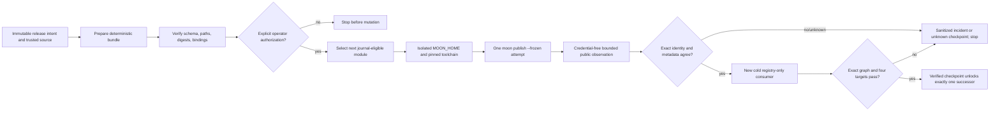

# Phase 8: Ordered Mooncakes Publication and Registry Consumers - Research

**Researched:** 2026-07-18  
**Domain:** Fail-closed Mooncakes publication, registry-only consumer qualification, and public metadata observation  
**Confidence:** HIGH for the local control-plane gaps and required contract; MEDIUM for live Mooncakes response shapes until the first credential-free observation is made.

<user_constraints>
## User Constraints (from CONTEXT.md)

### Locked Decisions

- **D-01:** Before any release tag or live dispatch, replace the Phase 7 `{}` prepared-manifest placeholder with a deterministic bundle that satisfies `release/prepared/schema.json`, contains every exact payload, validates every digest and binding, and is covered by positive and adversarial credential-free tests.
- **D-02:** Replace the null live adapter path with one tracked adapter that may publish only the next dependency-safe module from the verified journal. It uses `moon publish --frozen` from the exact prepared module source and cannot loop over all modules.
- **D-03:** The environment secret is materialized only inside the publisher step as the minimum ephemeral Moon credential state required by the pinned CLI, under a new isolated `MOON_HOME`; it is never passed as a command argument, printed, uploaded, or made available to prepare/consumer jobs. `MOON_TOOLCHAIN_ROOT` remains bound to the pinned installed toolchain.
- **D-04:** The first irreversible `tchivs/mb-core@0.1.0` publication remains an explicit operator checkpoint after the executable seam, clean trusted source, release intent, release tag, dry run, hosted settings, and current absent-version observation all pass. Autonomous planning and coding must stop at that checkpoint rather than consume the version implicitly.
- **D-05:** One authorized workflow run may attempt at most one module mutation. The fixed sequence is `mb-core mutation -> observe -> cold proof`, then `mb-color mutation -> observe -> cold proof`, then `mb-image mutation -> observe -> full-graph cold proof`.
- **D-06:** A downstream module is ineligible until the preceding module has an exact matching registry observation, a complete sanitized checkpoint, and its required four-target consumer proof. A successful CLI exit alone is insufficient.
- **D-07:** Each new run resumes the immutable root intent and verified journal chain. Duplicate dispatches re-observe existing state; they never republish an exact verified checkpoint.
- **D-08:** Every DIST proof runs in a newly created directory outside the checkout with a new empty `MOON_HOME`, an explicit pinned `MOON_TOOLCHAIN_ROOT`, no `credentials.json`, no `moon.work`, no path or Git dependency, no copied module source, and no pre-existing registry index, cache, `.mooncakes`, or target directory.
- **D-09:** Consumer manifests declare the intended `0.1.0` dependency floors, but proof must separately assert the actual resolved graph. Moon's minimal version selection means the manifest floor alone is not exact-version evidence.
- **D-10:** Record a normalized `moon tree`, registry-index version/dependency/checksum data, downloaded archive SHA-256, and the downloaded module manifest. The observed graph must be node-for-node equal to the expected `0.1.0` graph before target tests count.
- **D-11:** Reuse deterministic public behavior: checked/core for `mb-core`, public color behavior for `mb-color`, and bounded PPM encode/decode across the complete public graph for `mb-image`. Each consumer checks and tests `js`, `wasm`, `wasm-gc`, and real `native` with the pinned toolchain.
- **D-12:** Consumer jobs never receive the publisher secret.
- **D-13:** After a mutation attempt, use bounded credential-free polling across registry observation surfaces. Record intervals, attempts, timestamps, classifications, and terminal disposition deterministically.
- **D-14:** Timeout, nonzero publish exit, missing version, inconsistent checksums, or conflicting observation surfaces produce an `unknown` or incident checkpoint and stop; never automatically republish or advance downstream.
- **D-15:** Retry is permitted only through the Phase 7 forward-only authorization rules after read-only observation proves the exact version absent. Exact matches are checkpointed without mutation; mismatches require a newly qualified forward correction.
- **D-16:** PROV-05 uses Mooncakes' structured public API, registry index, downloadable archive, and versioned assets rather than scraping SPA HTML. Required fields are projected into a closed sanitized observation before comparison.
- **D-17:** Compare qualified identity, version, description, license, repository, README, package inventory, dependency graph, exposed targets, and strongest available checksum/identity. Missing, drifted, or ambiguous metadata blocks the next mutation.
- **D-18:** Live raw output is never committed. Sanitized observations, normalized graphs, target results, timestamps, and content digests are intent-bound checkpoint artifacts; Phase 9 owns immutable-ledger closure.
- **D-19:** The current pre-publication observation is freshness-sensitive and must be re-observed immediately before the first mutation.

### the agent's Discretion

- Exact bounded polling cadence/window.
- Exact cold-consumer layout and normalized evidence filenames, preserving independent reproducibility and closed, content-addressed evidence.
- One script or narrow helpers for public API/index/archive/assets observation, provided disagreement fails closed and network output is sanitized before persistence.

### Deferred Ideas (OUT OF SCOPE)

- Immutable ledger entries, GitHub release/provenance closure, and final milestone audit belong to Phase 9.
- Organization namespace migration, destructive recovery, multi-maintainer approvals, and new module families are outside v0.2.
</user_constraints>

<phase_requirements>
## Phase Requirements

| ID | Description | Research Support |
|----|-------------|------------------|
| DIST-01 | Publish core, then prove exact core registry consumption on four targets before color. | One-step live adapter, bounded observer, isolated core consumer, graph equality gate. |
| DIST-02 | Publish color only after core proof, then prove color plus core on four targets before image. | Journal selector derives only the next module; cold consumer records exact two-node graph. |
| DIST-03 | Publish image last, then prove full exact graph and bounded PPM behavior on four targets. | Full-graph consumer and node-for-node normalized graph comparison. |
| DIST-04 | Proof is cold, unauthenticated, registry-only, and records metadata, identity, graph, toolchain, targets, and behavior. | New directory, empty exported `MOON_HOME`, pinned `MOON_TOOLCHAIN_ROOT`, closed evidence schema. |
| PROV-05 | Read-only Mooncakes observation proves intended public metadata without mutation or credential disclosure. | Structured public manifest/index/archive/assets projection, digest comparison, and fail-closed disagreement. |
</phase_requirements>

## Summary

Phase 7 supplies the authorization, concurrency, journal, hosted environment, and secret-name boundary, but deliberately leaves its prepared artifact as `{}` and leaves `LiveOneStep` with no injected adapter. The current workflow therefore cannot reach its own prepared schema (`payloads.minItems = 11`) and fails before an intentional real mutation. It also creates a disposable directory without assigning it to `MOON_HOME`, so it does not establish the Phase 8 credential-isolation boundary. [VERIFIED: local `.github/workflows/publish-modules.yml`, `release/prepared/schema.json`, `scripts/quality/Invoke-ReleasePublisher.ps1`]

The correct Phase 8 implementation order is: make the prepared bundle executable and independently verifiable; add one journal-driven publishing adapter; add sanitized public observation and cold consumers; then stop at an explicit first-core-mutation checkpoint. After operator authorization, every workflow run may mutate one module only, observe it with public surfaces, perform a fresh no-credential four-target proof, and only then unlock the next dependency. [VERIFIED: local `08-CONTEXT.md`, `07-CONTEXT.md`, `07-03-SUMMARY.md`, `policy/release-qualification.json`]

**Primary recommendation:** Build deterministic, credential-free preparation/observation/consumer selectors first; keep the one actual `moon publish --frozen` call inside a journal-selected `LiveMutationAdapter`, and reserve its first invocation for the explicit core operator checkpoint.

## Architectural Responsibility Map

| Capability | Primary Tier | Secondary Tier | Rationale |
|------------|-------------|----------------|-----------|
| Prepared bundle generation and validation | CI preparation job | local quality scripts | It binds exact source, intent, journal, policies, and payload digests before secret access. |
| One-module mutation | CI publisher job | publisher script | The environment-gated step is the only secret-bearing boundary and must select exactly one eligible module. |
| Registry observation / public metadata proof | credential-free CI job | local observer helpers | It must read public structured surfaces and persist only sanitized normalized evidence. |
| Cold consumer proof | credential-free CI job | disposable MoonBit workspace | It must resolve from registry independently of repository/workspace state. |
| Authorization and recovery | immutable intent + journal | GitHub concurrency/artifacts | Root intent and verified records determine next eligibility; failures stop rather than retry implicitly. |

## Standard Stack

| Component | Locked version / contract | Purpose | Why it is standard here |
|-----------|---------------------------|---------|-------------------------|
| MoonBit CLI | `0.1.20260713 (75c7e1f 2026-07-13)` | `moon publish --frozen`, consumer check/test/tree | Pinned by `policy/registry-authority.json` and prepared schema. [VERIFIED: local policy/schema] |
| PowerShell quality scripts | repository scripts | Canonical JSON, SHA-256, closed schemas, sanitized journal/checkpoints | Existing Phase 6/7 release-control convention. [VERIFIED: local Phase 7 sources] |
| GitHub Actions artifact and environment boundaries | existing full-SHA-pinned actions | Separate credential-free preparation/consumer jobs from publisher job | Existing hosted contract; no new third-party dependency is needed. [VERIFIED: local workflow] |

**No external package installation is required.** Accordingly, no Package Legitimacy Audit applies.

## Architecture Patterns

### Pattern 1: Complete prepared bundle before publisher access

The prepare job must copy a closed, fixed inventory to `prepared/`, compute every payload's size and SHA-256, and serialize a manifest satisfying `release/prepared/schema.json`. Its own digest is an output, not a self-referential payload. The publisher repeats schema/binding/inventory/hash validation and rejects unrecognized paths or roles. [VERIFIED: local prepared schema and workflow]

### Pattern 2: Journal-selected single mutation

Replace the null adapter with a tracked function that verifies the exact prepared archive and journal chain, re-observes prior modules, selects only `mb-core`, `mb-color`, or `mb-image` according to the policy order, and runs one member-scoped `moon publish --frozen`. Do not implement a loop over module order. `LiveOneStep` already rejects a null adapter and requires explicit authorization; wire the adapter through that seam. [VERIFIED: local `Invoke-ReleasePublisher.ps1`, `policy/release-qualification.json`]

### Pattern 3: Cold consumer is a different trust domain

Create a unique directory outside the checkout. Set and export an empty `MOON_HOME`; set `MOON_TOOLCHAIN_ROOT` to the pinned installed location; create no `moon.work`, source copy, Git dependency, cache, target, `.mooncakes`, or credential. Generate only a small consumer module manifest and behavior program, resolve from registry, normalize `moon tree` plus registry index/archive/manifests, compare exact nodes, then check and test all four targets. [VERIFIED: local `08-CONTEXT.md`, `REQUIREMENTS.md`, `policy/release-qualification.json`]

### Pattern 4: Structured observation before presentation

Public API/index/archive/asset responses are untrusted input. Extract an allowlisted closed record of required fields, canonicalize it, hash it, and compare it to release qualification policy. Do not use SPA HTML scraping as machine authority and do not commit raw HTTP/CLI responses. [VERIFIED: local `08-CONTEXT.md`, `policy/registry-authority.json`]

## Don't Hand-Roll

| Problem | Do not build | Use instead | Why |
|---------|--------------|-------------|-----|
| Release ordering | A second independent scheduler | Existing immutable intent, publisher reducer, and journal contract | Two authority sources could permit out-of-order publication. |
| Manifest integrity | Ad hoc string checks | Existing prepared schema plus SHA-256 payload inventory | The publisher already expects closed paths, roles, sizes, bindings, and at least 11 payloads. |
| Exact dependency evidence | Reliance on manifest floors | Normalized resolved `moon tree`, index metadata, downloaded manifest, archive digest | MVS means `"0.1.0"` is a floor, not proof of exact resolved versions. |
| Public metadata proof | SPA HTML scraper | Structured public API/index/archive/assets projection | Rendered HTML is unstable and not an authority surface. |
| Failure recovery | Automatic republish / destructive registry operation | Re-observation plus forward-only correction rules | Existing policy explicitly fails closed on unknown/mismatch. |

## Common Pitfalls

### Prepared placeholder survives into a live run
`{}` hashes consistently but violates the required schema and payload minimum. Test preparation against the schema and publisher inventory before artifact upload; adversarial tests must reject empty, missing-role, digest-mismatch, path-traversal, and binding-mismatch bundles. [VERIFIED: local workflow and schema]

### Isolated directory is not an isolated Moon home
Creating `$moonHome` does not change the CLI state unless `MOON_HOME` is exported for the exact publisher process. Set both `MOON_HOME` and pinned `MOON_TOOLCHAIN_ROOT` inside the live step and remove the directory in `finally`; consumers independently create their own empty home. [VERIFIED: local workflow; locked D-03/D-08]

### Manifest dependency floor mistaken for exact resolution
Consumer manifests can declare `0.1.0` while an available higher version resolves. Require normalized resolved graph equality, index dependency/version/checksum data, and downloaded artifacts before accepting the target tests. [VERIFIED: locked D-09/D-10]

### Publish exit treated as success
Timeout, nonzero exit, partial response, inconsistent archive checksum, or disagreement between structured surfaces produces `unknown`/incident, re-observation, and stop. It never dispatches another module or repeats publish automatically. [VERIFIED: locked D-13 through D-15]

### Secret leaks into artifacts or downstream jobs
The token may only materialize in the publisher step's temporary Moon state. Never pass it as an argument, log it, write raw credential output, include it in prepared payloads, or expose it to observer/consumer jobs. [VERIFIED: locked D-03/D-12/D-18 and Phase 7 summary]

## Environment Availability

| Dependency | Required by | Available / status | Fallback |
|------------|-------------|--------------------|----------|
| Pinned MoonBit toolchain | publish and four-target cold consumers | Contracted by Phase 7 workflow; confirm in hosted run before live adapter | None; fail closed. |
| GitHub `mooncakes-production` environment and `MOONCAKES_TOKEN` name | isolated mutation step | Verified in Phase 7 hosted settings; value was not inspected | None; never substitute another credential source. |
| Public Mooncakes observation surfaces | currentness, propagation, PROV-05 | Must be live re-observed; existing records are freshness-sensitive | Stop with `unknown`; do not scrape SPA as fallback authority. |
| Native execution capability | real native consumer target | Existing state says native runtime verification is fail-closed | None; compile-only is not sufficient. |

## Validation Architecture

`workflow.nyquist_validation` is explicitly `false`; the phase still requires the existing focused PowerShell selectors, credential-free negative tests, hosted workflow validation, and post-mutation manual checkpoint.

| Requirement | Automated evidence before mutation | Live / checkpoint evidence |
|-------------|------------------------------------|----------------------------|
| DIST-01 | Prepared-bundle, adapter-order, and core-cold-consumer fixture tests; reject source/workspace/credential contamination. | Explicit core publish checkpoint, exact observation, core graph equality, four target behavior. |
| DIST-02 | Color eligibility and two-node graph fixture tests; reject advance without verified core checkpoint. | Color mutation only after core proof; exact core+color cold proof. |
| DIST-03 | Full graph, PPM behavior, and selector-order fixtures. | Image mutation only after color proof; exact 3-node graph and four-target PPM proof. |
| DIST-04 | Isolation/negative fixtures prove empty homes, no `moon.work`, source, Git, caches, or secret. | Sanitized evidence records include toolchain, observation, archive digest, graph, targets, behavior. |
| PROV-05 | Closed projection/normalization tests and disagreement/secret-redaction fixtures. | Credential-free structured public observations for all published modules; no raw response committed. |

### Required pre-live selectors

1. Schema and positive/adversarial prepared-bundle tests.
2. Publisher adapter tests proving a null/loop/out-of-order adapter cannot mutate.
3. Cold-consumer isolation and graph-equality fixture tests for each graph layer.
4. Registry-observation normalization, redaction, polling bounds, and disagreement tests.
5. Existing Phase 7 Required / hosted-settings checks, preserving the credential-free Required boundary.

## Security Domain

| ASVS-style concern | Applies | Control |
|--------------------|---------|---------|
| Authentication / credential handling | Yes | Environment secret exists only in one publisher step; ephemeral exported `MOON_HOME`; no command argument/log/artifact exposure. |
| Authorization | Yes | Sole maintainer + exact immutable intent/source/tag inputs; explicit core checkpoint. |
| Access control | Yes | Separate CI jobs and empty permissions by default; publisher is environment-gated and actions-read only. |
| Input validation | Yes | Closed JSON schemas, canonical digest checks, path allowlisting, response projection, graph equality. |
| Integrity | Yes | Content-addressed prepared payloads, archives, manifest/index observations, and checkpoint chain. |
| Availability / ambiguity | Yes | Bounded polling, explicit terminal disposition, stop on unknown/disagreement. |

## Sources

### Primary (HIGH confidence)
- [VERIFIED: local `08-CONTEXT.md`] Locked scope, ordered publication, cold consumer, public observation, and checkpoint decisions.
- [VERIFIED: local `release/prepared/schema.json`] Required closed prepared-bundle fields, payload roles, and eleven-item lower bound.
- [VERIFIED: local `.github/workflows/publish-modules.yml`] Current `{}` prepared placeholder, publisher validation, null adapter invocation, and unexported `$moonHome` gap.
- [VERIFIED: local `scripts/quality/Invoke-ReleasePublisher.ps1`] Existing preflight/rehearsal/reducer/live adapter seam and explicit live guard.
- [VERIFIED: local `policy/release-qualification.json`] Canonical module order, exact versions, dependencies, target set, public metadata, and archive exclusions.
- [VERIFIED: local `policy/registry-authority.json`] Freshness, redaction, current-fact, and fail-closed authority policy.
- [VERIFIED: local `REQUIREMENTS.md`, `ROADMAP.md`, `STATE.md`] DIST-01..04/PROV-05 contract and Phase 8 readiness.

## Assumptions Log

| # | Claim | Section | Risk if Wrong |
|---|-------|---------|---------------|
| A1 | Structured public surface field names and response formats will be discovered by a credential-free preflight rather than assumed. | Observation implementation | Incorrect projection could fail legitimate observations; implementation must add fixtures from sanitized samples. |
| A2 | Pinned hosted Moon installation can expose a stable `MOON_TOOLCHAIN_ROOT` path to the publisher and consumer processes. | Environment | A missing path must fail closed before publish, not fall back to ambient tooling. |

## Open Questions

1. Which public API/index/archive/assets endpoints and field names are currently exposed by Mooncakes?
   - Recommendation: implement one credential-free discovery/projection selector that records only sanitized allowlisted data; accept no endpoint by training-data assumption.
2. What minimum ephemeral file shape does the pinned CLI require under `MOON_HOME` for token authentication?
   - Recommendation: implement it only in the publisher step with the secret streamed into the required local state; test redaction and teardown without exposing the token.
3. Does the hosted native runner satisfy real runtime proof for the pinned MoonBit toolchain?
   - Recommendation: verify before the first core checkpoint; reject compile-only substitution.

## Metadata

**Confidence breakdown:**
- Standard stack: HIGH - all components and version contracts are present in local Phase 7/8 authority files.
- Architecture: HIGH - the existing workflow and publisher seam expose exact integration gaps.
- Live observation semantics: MEDIUM - endpoint/response details intentionally require fresh credential-free verification.

**Research date:** 2026-07-18  
**Valid until:** First live observation or any Moon/Mooncakes tooling change; freshness-sensitive facts must be re-observed immediately before mutation.
